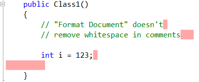
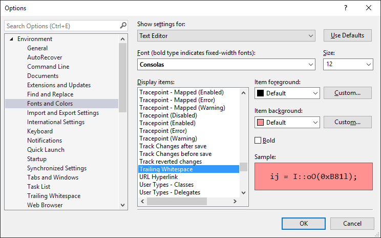
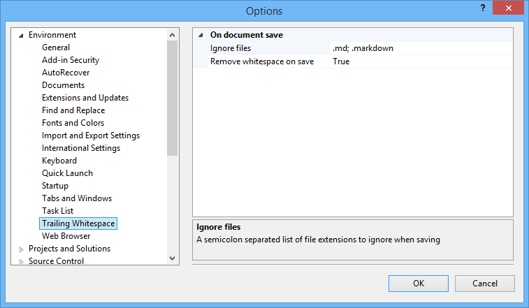

## Trailing Whitespace Visualizer

This extension will highlight and remove any trailing 
whitespace on any line in any editor in Visual Studio.

Download and install the extension from the
[Visual Studio Gallery](http://visualstudiogallery.msdn.microsoft.com/a204e29b-1778-4dae-affd-209bea658a59)
or get the
[nightly build](https://ci.appveyor.com/project/madskristensen/trailingwhitespace/build/artifacts).

### Remove trailing whitespace
You can very easily delete all the trailing whitespace in a file by executing the **Delete Horizontal White Space** command
found in **Edit** -> **Advanced** or by using the shortcut key combination Ctrl+K, Ctrl+\

### Changing the background color
You can change the background color from the
**Tools -> Options** dialog under the
**Environment -> Fonts and Colors** settings.

The setting is for the *Text Editor* and the display
item is called *Trailing Whitespace*.

### Ignore rules
It's easy to add specify what file patterns to ignore. Any
ignored file will have whitespace colorized or removed
on save.

By default, file paths with any of the following strings
contained in it will be ignored:

- \node_modules\
- \bower_components\
- \typings\
- \lib\
- .min.
- .md
- .markdown
- .designer.

You can modify these rules in the **Tools -> Options** dialog.

### Remove on save
Every time a file is saved, all trailing whitespace is removed. This can be disabled in the
**Tools -> Options** dialog.

### Trim only modified lines

A new option is available to only remove trailing whitespace from lines that have been added or modified since the file was opened. When this is enabled, lines that have not been touched will be ignored by the "remove on save" feature.

This is useful for preserving history and blame information in source control, as it prevents cosmetic changes to old code.

You can enable this feature in the **Tools -> Options -> Environment -> Trailing Whitespace** dialog by checking the "Trim only modified lines" option.

## Contribute
Check out the [contribution guidelines](.github/CONTRIBUTING.md)
if you want to contribute to this project.

For cloning and building this project yourself, make sure
to install the
[Extensibility Tools 2015](https://visualstudiogallery.msdn.microsoft.com/ab39a092-1343-46e2-b0f1-6a3f91155aa6)
extension for Visual Studio which enables some features
used by this project.

## License
[Apache 2.0](LICENSE)